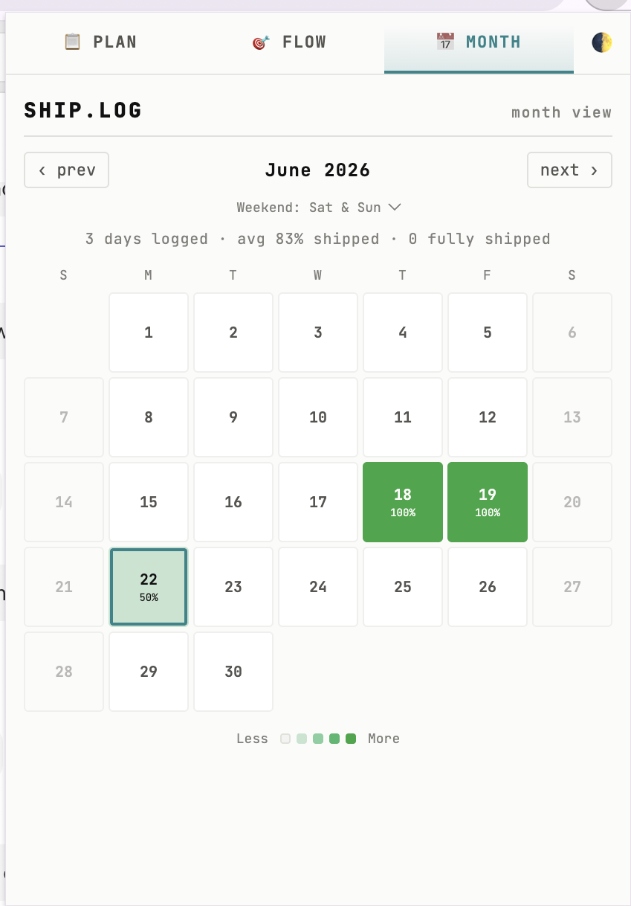
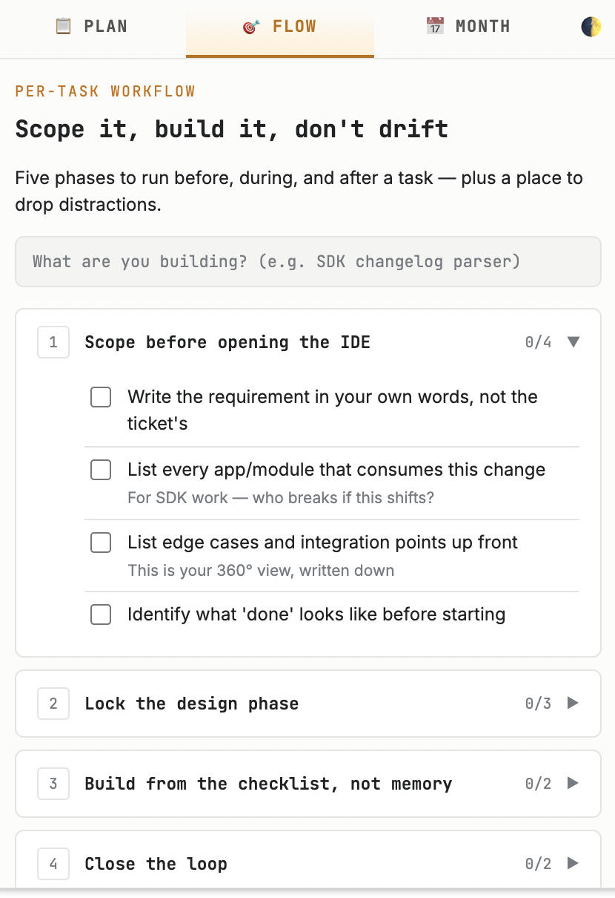
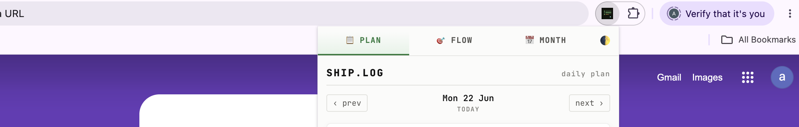

# SHIP.LOG 🚢

**SHIP.LOG** is a premium, developer-focused Chrome Extension designed to help software engineers track their daily velocity, manage pending Merge Requests, and visualize their productivity without the bloat of heavy project management tools.





## ✨ Features

- **📝 Daily Planning & Priorities:** Easily log your daily tasks and unexpected new priorities. Assign effort tags (S, M, L) to gauge your workload.
- **🧪 Quality Enforcement (UT & MR):** When you mark a task as complete, SHIP.LOG prompts you to input your **MR Link** and **Unit Test Results/Proof**. This enforces good developer habits and ensures nothing is shipped blindly.
- **🔀 Ready to Merge Tracker:** Keep a dedicated list of MRs that are completed on your end but are waiting for reviews or approvals, so they never slip through the cracks.
- **🟩 GitHub-Style Heatmap:** The Month View automatically generates a beautiful, monochrome green heatmap (just like your GitHub contribution graph) based on your daily completion percentage.
- **🌓 Dark & Light Themes:** A sleek, minimalist UI featuring glassmorphism effects, crisp typography (Inter & JetBrains Mono), and a persistent toggle to switch between a deep dark mode and a crisp light mode.
- **🔒 Privacy First:** 100% offline. All your data is saved securely on your machine using `chrome.storage.local`.

## 🚀 Installation

Since this is an unpacked Chrome Extension, you can easily install it locally in your browser:

1. Clone or download this repository to your local machine:
   ```bash
   git clone https://github.com/yourusername/ship-log.git
   ```
2. Open Google Chrome and navigate to the Extensions management page by typing `chrome://extensions/` in your address bar.
3. Enable **"Developer mode"** by toggling the switch in the top-right corner.
4. Click the **"Load unpacked"** button in the top-left corner.
5. Select the directory where you cloned/extracted the `ship-log` files.
6. **SHIP.LOG** is now installed! You can pin it to your toolbar for quick access.

## 🛠️ Tech Stack

- **Core:** HTML5, Vanilla JavaScript (ES6+)
- **Styling:** Vanilla CSS (CSS Variables, Flexbox, CSS Animations)
- **Storage:** Chrome Extension API (`chrome.storage.local`)
- **Fonts:** Inter (Sans-serif), JetBrains Mono (Monospace)

## 💡 How to Use

- **Add Tasks:** Open the extension and add tasks to your `📋 DAILY PLAN`.
- **Complete Tasks:** Click the checkbox next to a task. A modal will pop up asking for your MR Link and Unit Test results.
- **Carry Over:** Tasks you didn't finish today will automatically be carried over to tomorrow's list.
- **View Progress:** Click the `🗓 MONTH` tab to see your GitHub-style heatmap. You can configure your weekend days via the dropdown menu to match your schedule.

## 🤝 Contributing

Pull requests are welcome! If you have ideas for new features or find a bug, feel free to open an issue.

## 📜 License

[MIT License](LICENSE)
